# GO语言实现 一 并查集

我们考虑以下问题：

已知图结构如下，请问 

（1）0号节点与 7号节点是否连通?

（2）0号节点与 8号节点是否连通?

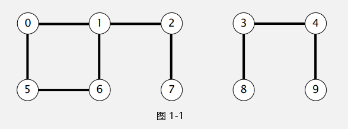

泛化一下，给定任意图，我们如何判断其中的某两个节点是否连通。

与此类似的，我们可以将上述问题中的节点扩展到以下范围：
* 数码照片中的像素
* 网络中的计算机
* 社交网络中的朋友
* 计算机芯片中的晶体管
* 数学集合中的元素
* Fortran程序中的变量名

这个问题不难，我们需要一个合适的数据结构存储节点与节点之间的关系，这也引出了这篇博文的主题

## ***并查集***
<!-- 首先，我们要先了解，节点的连通具有如下属性：
* 自反性：p节点和 p节点是连通的
* 对称性：如果 p节点和 q节点是连通的，那么 q节点和 p节点也是连通的
* 传递性：如果 p节点和 q节点是连通的，并且 q节点和 r节点是连通的，那么 p节点和 r节点也是连通的

我们可以将上述所有连通的节点写成一个集合 -->

首先我们将图1-1 中的所有连通子图定义为数字集合的形式

```
 {0,1,2,5,6,7}, {3,4,8,9} 
```

每一个集合表示一个连通子图，集合中的各个元素彼此均为连通状态

在实现上，我们可以创建一个数组（id）来模拟各个节点，用索引来表示不同的节点，用值来代表节点之间的连通状态。

我们主要需要实现以下两个方法：

***Connected(p int, q int)*** 检查 p节点和 q节点是否连通

***Union(p int, q int)*** 连接 p节点和 q节点

------

### ***1.Quick-find***

我们在每个集合中挑选一个节点作为根节点（root），指向同一个根节点的节点则为同一个集合（连通子图）
```
Connected: 检查 p节点和 q节点是否有相同的 id

Union: 将 id数组中所有根为 p节点的节点，将其根更改为 q节点
```

我们选择序号最小的节点作为根，则图 1-1的 id数组如下
```
id := {0,0,0,3,3,0,0,0,3,3}
```
回到问题

（1）id[0] = 0，id[7] = [0]，故 0号节点与 7号节点连通

（2）id[0] = 0，id[8] = [3]，故 0号节点与 8号节点不连通

代码如下：
```
// 定义结构体
type quick_find struct {
	id []int
}

// 初始化过程，每个节点指向自己
func quick_find_init(n int) quick_find {
	var qf quick_find
	qf.id = make([]int, n)
	for i, _ := range qf.id {
		qf.id[i] = i
	}
	return qf
}

// 将所有指向 p节点的节点，重新指向 q节点
func (qf quick_find) union(p int, q int) {
	id := qf.id
	pid := id[p]
	qid := id[q]
	for i, _ := range id {
		if id[i] == pid {
			id[i] = qid
		}
	}
}

// 判断节点之间是否连通
func (qf quick_find) connected(p int, q int) bool {
	return qf.id[p] == qf.id[q]
}
```

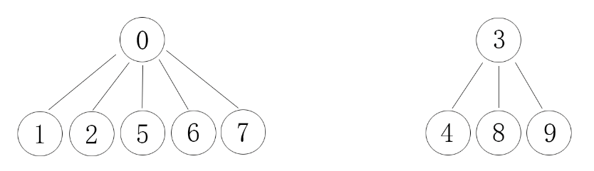

接下来我们分析以下算法的复杂度

节点数 n

初始化过程 O(n)

单次union过程 O(n)

connected过程 O(1)

整个算法的时间复杂度为 O(mn)，n 为节点数，m 为连接数

考虑最坏情况，整个图各个节点都是连通的，则 union总耗时为 O(n^2)

------

### ***2.Quick-union***

Quick-find方法中 id 数组每个节点的值表示为根节点，union过程太过耗时，我们尝试优化一下

如下定义 id 数组：id[i] 中的值表示为 i 的父亲节点，而不必再是根节点

我们可以递归使用 id 数组获取 i 节点的根节点 id[id[id[...id[i]...]]]

由此，我们定义一个新的方法

***root(int i)***  获取 i节点的根节点

connected 方法则修改为比较 p 节点和 q 节点的根节点

union 方法修改为 p 节点和 q 节点的挂载，而不需要遍历整个数组，重新修改指向

代码如下
```
// 定义结构体
type quick_union struct {
	id []int
}

// 结构体初始化
func quick_union_init(n int) quick_union {
	var qf quick_union
	qf.id = make([]int, n)
	for i, _ := range qf.id {
		qf.id[i] = i
	}
	return qf
}

// 获取 p节点的根节点
func (qf quick_union) root(p int) int {
	id := qf.id
	if id[p] != p {
		p = id[p]
	}
	return p
}

// 连接 p 节点和 q 节点，只需要将其根节点挂载即可
func (qf quick_union) union(p int, q int) {
	pRoot := qf.root(p)
	qRoot := qf.root(q)
	qf.id[qRoot] = pRoot
}

// 判断 p节点和 q节点是否连通
func (qf quick_union) connected(p int, q int) bool {
	return qf.root(p) == qf.root(q)
}
```

我们将 图 1-1中的例子修改一下，考虑整个图为一整个连通图

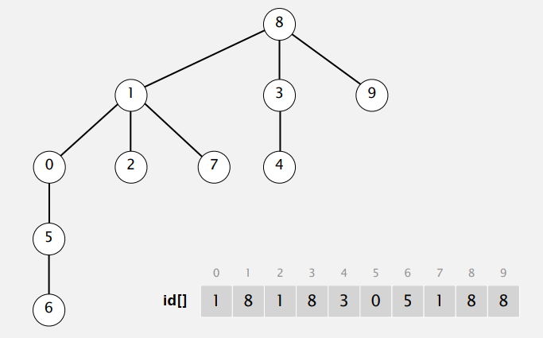

接下来我们分析以下算法的复杂度

节点数 n

初始化过程 O(n)

union过程 O(h)，主要是 root方法耗时

connected过程 O(h)

如果整棵树非常 “竖直” ，树的深度很深，h 很接近 n，那么 root 方法会非常耗时

整个算法的时间复杂度还是 O(mn) n 为节点数，m 为连接数

似乎优化不是很明显

我们试试看能不能扁平化整棵树

------

### ***3.Quick-union-improvement***

我们尝试在原有的结构体上添加一个 sz 数组，用来表示以该节点为根的树的深度

在 union 操作挂载节点的时候，我们优先把 sz 小的节点挂载在 sz 大的节点上，由于树的深度由最深的分支决定，所以这种挂载并不会增加树的深度，只有当两者的 sz 大小一样时，才会将 sz 增1

```
func (qf quick_union_improve) union(p int, q int) {
	id := qf.id
	sz := qf.sz
	pRoot := qf.root(p)
	qRoot := qf.root(q)
    // 节点 sz 数组负载均衡
	if qf.sz[pRoot] > qf.sz[qRoot] {
		id[qRoot] = id[pRoot]
		sz[pRoot] += sz[qRoot]
	} else {
		id[pRoot] = id[qRoot]
		sz[qRoot] += sz[pRoot]
	}
}
```
时间复杂度

节点数 n

初始化过程 O(n)

union过程 O(lg(n))，主要是 root方法耗时

connected过程 O(lg(n))

整个算法时间复杂度变为 O(mlg(n)) n 为节点数 m 为连接数

那么整个算法还有能够优化的空间

------

### ***4.Quick-union-improvement-compress***

我们知道整个过程中，最消耗时间的就是 root 方法，于是我们可以考虑在 root 方法追溯根的时候将 p 节点从原来的位置卸下来，直接挂载在 root 节点上，这样，下次追溯时所需时间就会大大减少，也就是路径压缩

```
func (qf quick_union_improve_compress) root(p int) int {
	id := qf.id
	if id[p] != p {
		p = id[p]
        // 每次追溯时，都将节点连接到根节点上
		id[p] = id[id[p]]
	}
	return p
}
```
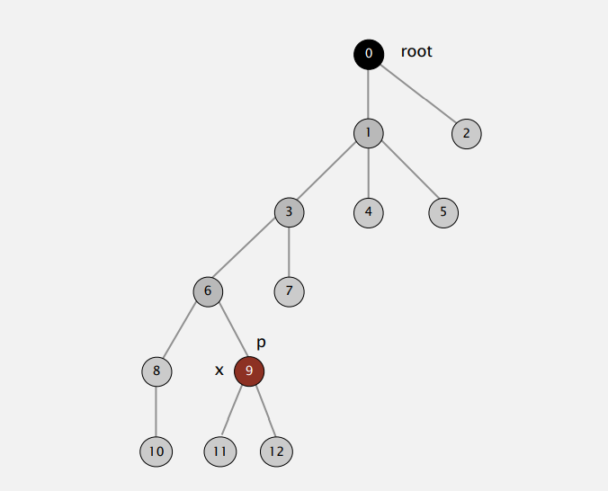
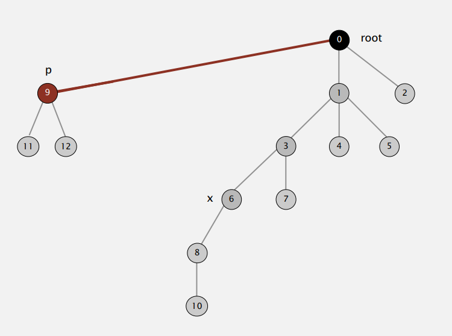
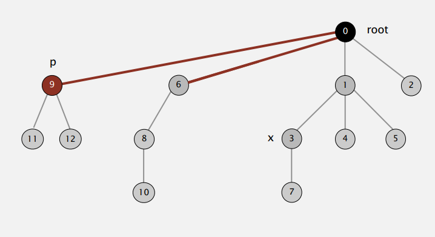
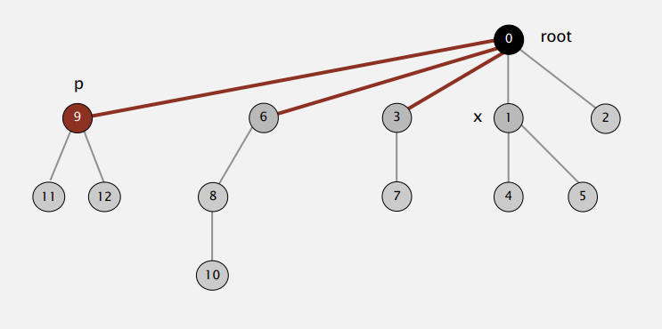
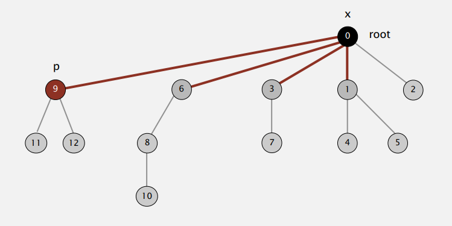

这里的时间复杂度证明很复杂，有数学家给与过证明

时间复杂度为 n+mlg*n

其中 lg*n 为迭代对数，增长十分缓慢，可以被视为一个常数

于是整个过程的时间复杂度可以被视为 O(n+m) n 为节点数，m 为连接数

------

### ***5.application***

存在一个 N*N 的矩阵，其中每个格子有 p 的概率为可连接状态，从而有 (1-p) 的概率为不可连接状态

如果从矩阵第一行到矩阵最后一行有一条可连接状态的路径（路径上所有格子都为可连接状态）则称为 percolate，否则称为 not percolate

问，当 N 很大时，求 p*，其中 p*满足：

当 p > p* 时，矩阵有极大概率为 percolate

当 p < p* 时，矩阵有极大概率为 not percolate

这个题目考察的就是并查集的应用

当 N = 5 时，首先，我们对矩阵进行编码，来存储整个矩阵，同时他们的连通状态我们也可以存储，白色块便是可连接，黑色块表示不可连接。

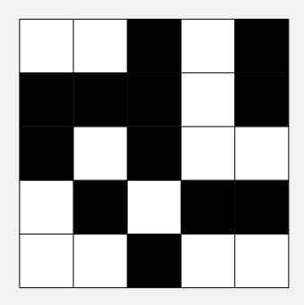
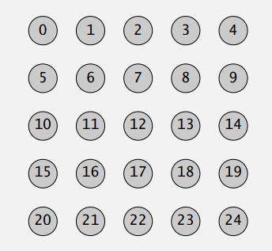

接着，我们将连通路径标注出来，于是问题就被我们抽象为 top row 与 bottom row 之间的连接问题

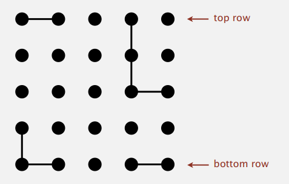

如果我们考虑两排之间的连接，时间复杂度会骤升到 O(n^2)，我们可以设立一个虚拟节点。

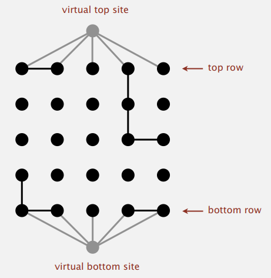

问题转化为两个虚拟节点之间的连接问题，如果我们使用额外的节点作为虚拟节点，索引节点会增添不少的麻烦，我们可以将第 0 个和第 n*n-1 个节点作为虚拟节点。第一排所有的可连接节点都连接到第 0 号节点，最后一排所有的可连接节点都连接到第 n\*n-1 个节点，最后检验第 0 号节点和第 n\*n-1 号节点之间的连接关系即可。

```
// 定义结构体
type Percolation struct {
	matrix [][]int
}

/**
    矩阵初始化
    参数 n：节点的规模
    参数 p: 每个节点可连接的概率
**/
func Percolation_init(n int, p float64) Percolation {
	var per Percolation
    // 使用纳秒作为随机种子
	rand.Seed(time.Now().UnixNano())
	per.matrix = make([][]int, n)
	for i, _ := range per.matrix {
		per.matrix[i] = make([]int, n)
		for j, _ := range per.matrix[i] {
            // 0 表示连通，1表示不连通
			if rand.Float64() < p {
				per.matrix[i][j] = 0
			} else {
				per.matrix[i][j] = 1
			}
		}
	}
	return per
}

// 不同包下的 get 方法
func (per Percolation) GetMatrix() [][]int {
	return per.matrix
}

// 主函数
func main() {
    // 矩阵规模
	const n = 1000
    // 循环总次数（概率的分母）
	const count = 1000
    // 统计次数（10次重复，减小误差）
	const wcount = 10
    // 概率 p
	const p = 0.592746
	var index2 = 0
	for index2 < wcount {
		var p_shark = 0
		var index = 0
		for index < count {
			time.Sleep(5 * time.Millisecond)
            // p_shark 统计 percolate 的次数
			if quick_union_test(n, p) {
				p_shark++
			}
			index++
		}
        输出概率
		fmt.Println(float64(p_shark) / float64(count))
		index2++
	}
}

// 验证 percolate 的方法
func quick_union_test(n int, p float64) bool {
    // 初始化矩阵
	var pers = application.Percolation_init(n, p)
	var matrix = pers.GetMatrix()
	var qu = quick_union_improve_compress_application_init(n)

    // 输入连接
	for i, _ := range matrix {
		for j, _ := range matrix[i] {
            // 必须是可连接的块
			if matrix[i][j] == 0 {
                // 如果是第一排元素，都和 0 号元素连接
				if i == 0 {
					qu.union(j, 0)
				}
                // 如果是最后一排元素，都和 n*n-1 号元素连接
				if i == n-1 {
					qu.union(i*n+j, n*n-1)
				}
                // 向下连接
				if i > 0 && matrix[i-1][j] == 0 {
					qu.union(i*n+j, (i-1)*n+j)
				}
                // 向上连接
				if i < n-1 && matrix[i+1][j] == 0 {
					qu.union(i*n+j, (i+1)*n+j)
				}
                // 向左连接
				if j > 0 && matrix[i][j-1] == 0 {
					qu.union(i*n+j, i*n+j-1)
				}
                // 向右连接
				if j < n-1 && matrix[i][j+1] == 0 {
					qu.union(i*n+j, i*n+j+1)
				}
			}
		}
	}
    返回 0 号元素和 n*n-1 号元素是否连接
	return qu.connected(0, n*n-1)
}
```

我们可以注意到，如果 0 号节点或者 n\*n-1 是不可连接的，首先，他们自己不会与周边节点进行连接，而且其他连接到第一排或者最后一排的节点，最后还是会连接到 0 号或者 n\*n-1 号节点。因此我们只需要判断 0 号和 n\*n-1 号节点的连接状态即可

我们可以使用 0 - 1 之间不同的 p 去验证结果。我们得到概率 p 和 percolate 概率之间的关系

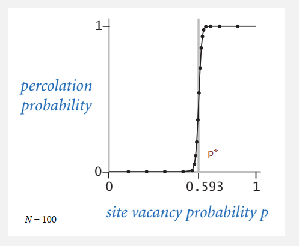
